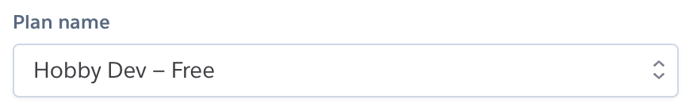
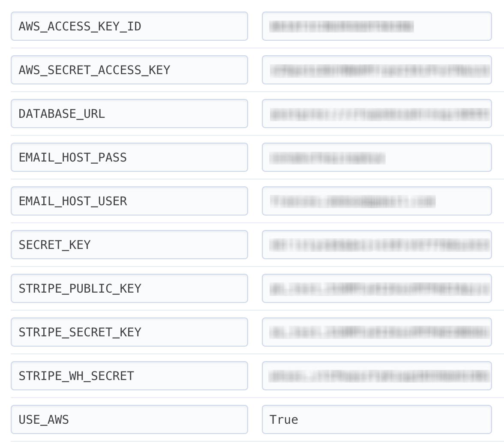

 
 

# Table of contents
1. [Introduction](#introduction)
    * [Objective](#objective)
    * [User stories](#users)
    * [Wireframes](#wireframes)
    * [Design Notes](#design)
2. [UX](#design)
3. [Features](#features)
    * [Existing Features](#existing_feat)
    * [Features left to implment](#future_feat)
4. [Information Architecture](#models)
5. [Technologies Used](#technologies)
6. [Testing](#testing)
7. [Deployment](#deploying)
    * [Run Locally](#local)
    * [Deploy to Heroku](#heroku)
8. [Credits](#credits)
    * [Content](#content)
    * [Media](#media)
    * [Acknowledgements](#acknowledgements)

# Introduction 

## Objective 
+ This app provides a platform for private members at an events venue to reserve their hospitality package for upcoming events  

## User Stories 
"As a box owner, I would like to ___________"
+ View the upcoming events 
+ Sort the events by category
+ View individual events in more detail
+ Reserve my box for an upcoming event
+ View different food packages
+ Select a food package
+ Select a drinks package
+ Provide details of the number of guests attending and dietary requirements
+ Review order before placing it
+ Easily Enter Payment information
+ Feel my personal and payment information is secure
+ View my order confirmation after checkout
+ Receive a confirmation email after the checokout is complete
+ Cancel my reservation
+ Modifiy my reservation details
+ View my order history

"As a hospitality manager I would like to _________"
+ Create new members and provide them a one time login
+ Add new events that have just been announced
+ Add and update food packages for the year ahead
+ Add and update drinks packages for the year ahead

## Wireframes 

 
 

 

 
 

 

 
 

## Design Notes 
### Typography
+ The fonts chosen for this project are <b>"Lobster Two,"</b> <b>"Open Sans"</b> and <b>"EB Garamond."</b> from google fonts
+ Lobster Two is a cursive display font used in this project for the logo and top level headings. It's ligatures that connect individual characters give it the elegance of script but  
+ Any quoted data such as the searched input returned in the 'no results found' message is written in EB Garamond italic. This serif font is traditional and elegant and compliments Patua One.

 
 

# Information Architecture 
## Models

***

&nbsp;

## Profile:

&nbsp;

### Suite

| Name          | Key in db     | Field Type   | Options                   |
|:--------------|:--------------|:-------------|:--------------------------|
| Suite Number  | suite_no      | IntegerField | primary_key=True          |
| Capacity      | capacity      | IntegerField | max_value=24, blank=True  |

&nbsp;

### Account

| Name        | Key in db   | Field Type           | Options                    |
|:------------|:------------|:---------------------|:---------------------------|
| Suite       | suite       | OneToOneField(Suite) |                            |
| Name        | name        | CharField            | max_length=75              |
| Email       | email       | EmailField           | max_length=75              |
| Address 1   | address1    | CharField            | max_length=75              |
| Address 2   | address2    | CharField            | max_length=500, blank=True |
| Postcode    | postcode    | CharField            | max_length=75              |
| City        | city        | CharField            | max_length=75              |
| Country     | country     | CharField            | max_length=75              |

&nbsp;

* * *

&nbsp;

## Events:

&nbsp;

### Category

| Name          | Key in db     | Field Type | Validation                |
|:--------------|:--------------|:-----------|:--------------------------|
| Name          | category_name | CharField  | max_length=75             |
| Friendly Name | friendly_name | CharField  | max_length=75, blank=True |

&nbsp;

### Event

| Name        | Key in db   | Field Type                                     | Validation                 |
|:------------|:------------|:-----------------------------------------------|:---------------------------|
| Name        | event_name  | CharField                                      | max_length=75              |
| Date        | date        | DateTimeField                                  |                            |
| Category    | event_type  | ForeignKey(Category)                           | on_delete=""               |
| Description | description | TextField                                      | max_length=500, blank=True |
| Image_url   | image_url   | UrlField                                       | blank=True                 |
| Image       | image       | ImageField                                     | blank=True                 |
| Suites      | suites      | ManyToManyField(Suite, through='Reservations') | blank=True                 |

&nbsp;

* * *

&nbsp;

## Reservations:

&nbsp;

### Food Package

| Name  | Key in db | Field Type   | Validation                                            |
|:------|:----------|:-------------|:------------------------------------------------------|
| Type  | title     | CharField    | max_length=75, blank=False                            |
| Price | price     | DecimalField | max_digits=6, decimal_places=2, null=False, default=0 |

&nbsp;

### Drinks Package

| Name  | Key in db | Field Type   | Validation                                            |
|:------|:----------|:-------------|:------------------------------------------------------|
| Type  | title     | CharField    | max_length=75, blank=False                            |
| Price | price     | DecimalField | max_digits=6, decimal_places=2, null=False, default=0 |

&nbsp;

### Reservation:

| Name           | Key in db     | Field Type         | Validation                 |
|:---------------|:--------------|:-------------------|:---------------------------|
| Suite          | suite         | ForeignKey(Suite)  | max_length=75              |
| Event          | event         | ForeignKey(Event)  |                            |
| Guests         | guests_no     | IntegerField       |                            |
| Food Package   | food_package  | ForeignKey(Food)   | max_length=500, blank=True |
| Drinks Package | drink_package | ForeignKey(Drinks) | blank=True                 |

&nbsp;

***

&nbsp;

 
 

# Deployment 

 ## Run Locally {#local}

 > In order to run the project locally, you will need an IDE, PIP, Python (version 3) and Git installed.
You will need to set up a free account with Stripe and with AWS for a S3 bucket.

1. Visit the bookmybox repository on Github; [https://github.com/fdeboo/bookmybox](https://github.com/fdeboo/bookmybox) and click on  to clone or download it.

2. Either: 
    * Copy the web url. In the terminal of your IDE, change directory / `cd` to  where you want the project saved on your system.
    * Type `git clone` and paste in the copied web url to complete the command _(as below)_: 

            git clone https://github.com/fdeboo/bookmybox.git
    
    
    **_or_**

    * Click to **Download Zip** and save the folder somewhere on your local system
    * File > Open the project from within your IDE
    
3. Activate a virtual environment. For this, I recommend using the **pipenv** package which manages the virtualenv and automatically adds/removes packages to a Pipfile when they are un/installed.   
    * On MacOS, pipenv is installed simply by typing `brew install pipenv` in the Mac Terminal. You can read more about pipenv and its installation using other software [here](https://pypi.org/project/pipenv/). 

        > _NOTE: The Pipfile created by **pipenv** supersedes the requirements.txt_
    
    * Once pipenv insalled, activate it with the following command:

        <pre><code>pipenv shell</code></pre>

4. Install the project dependencies detailed in the Pipfile by typing  

        pipenv install

5. Set up a .env file in the project root and provide the folllowing environment variables: 

    _*for guidance on where to obtain these values click [here](#guidance)_

        SECRET_KEY=your_secret_key
        STRIPE_PUBLIC_KEY=your_stripe_public_key
        STRIPE_SECRET_KEY=your_stripe_secret_key
        STRIPE_WH_SECRET=your_stripe_wh_secret
        DEVELOPMENT=True

    >_Important! Make sure you set up a .gitignore file and list .env in it so that it is ignored in commits to GitHub_

6. If using VSCode, or else if necessary, restart the IDE and reactivate the virtual environment (as per step 3)

7. Migrate the admin panel models to create the database template:

        python3 manage.py migrate

9. Create a 'superuser' account for access to the django admin panel: 

        python3 manage.py createsuperuser

10. Finally, run the app locally with the following command:
    
        python3 manage.py runserver

 ## Deploying to Heroku 
> _NOTE: The Pipfile created by **pipenv** supersedes the requirements.txt and contains all information for the dependencies of the project. Therefore a requirements.txt is not necessary in this project._

1. Type the following command into the Terminal to create a Procfile:
        
        echo web: python app.py > Procfile

2. Change the contents of the Procfile to: 

        web: gunicorn bookmybox.wsgi:application
    
3. Login to Heroku and click **New** from your Personal dashboard to **Create a New App**.

4. Give the app a unique name and choose the relevant region.

5. In the dashboard for the newly created app, set the **Deployment Method** (found under **Deploy** tab) to Connect to Github.

6. Fill out your Github details and search for your repository. Click to connect.

7. Choose whether you want to deploy Automatically or Manually.

8. Navigate to **Resources** and search for _postgres_ in the Add-ons search bar. Choose **Heroku Postgres** from the dropdown.

9.  Make sure the 'Plan name' is set to **Hobby Dev - Free**

    

10. Navigate to **Settings** and click on **Reveal Config Vars**.

11. Ensure the following are set:

    _*for guidance on where to obtain these values click [here](#guidance)_

    
    
     

    ***    

    #### Guidance   

     AWS_ACCESS_KEY_ID: 
    
     + Create an account / Sign in to AWS and navigate to the **AWS Management Console**
     + Search for S3 in AWS Services and **Create a bucket**. Follow the AWS [documentation.](https://docs.aws.amazon.com/AmazonS3/latest/user-guide/create-configure-bucket.html)
     + Create a User via the IAM service provided by aws

    AWS_SECRET_ACCESS_KEY:

    + As above
    + copy the Secret Access Key

    DATABASE_URL _(for production)_    
    + This value is pre-populated by Heroku in the Config Vars. Alternatively, you can type `Heroku config` in the CLI

    EMAIL_HOST_USER: 
    + Your gmail account address
    
    EMAIL_HOST_PASS (steps are based on gmail account): 
    + Sign in to gmail and go to **Settings** > _See all settings_.  
    + Navigate to **Accounts &amp; Import** > **Other Google Account Settings.**
    + From the side menu, click on **Security** and follow the steps to turn on 2-Step Verification.
    + Click on **App Passwords**, choose 'Mail' from the first dropdown and 'other' from the second, giving it a reference i.e 'Django'

    SECRET_KEY:
    + Type `python3` in the terminal and then type `import secrets` and hit enter. Type `secrets.token_urlsafe(48)` to generate a secure randomized byte string containing 48 bytes.

    STRIPE_PUBLIC_KEY:
    + Create an account / Sign in to Stripe
    + From the side menu, click on **Developers** > **API Keys**
    + Copy the Publishable Key token

    STRIPE_SERET_KEY:
    + As above
    + Copy the Secret Key token

    STRIPE_WH_SERET:
    + As above
    + From the side menu, click on **Developers** > **Webhooks**
    + Click on button to '+ Add endpoint'.
    + Provide your endpoint url. If you are working locally, you may need to take these extra steps for a temporary url:
        - Install ngrok. (On MacOs, `brew install ngrok`)
        - Type `ngrok http  8000` in the terminal
        - Add the temporary server address to ALLOWED_HOSTS in the app settings eg. `[“9e96e1506ea8.ngrok.io”, “127.0.0.1”]`
        > Remember to append the path for the checkout to the end of the url, including the trailing '/':  `/checkout/wh/`
    + Click the link alternative to **'receive all events'** in the 'Events to send' section and then 'Add endpoint'
    + Copy the Signing secret provided.

    USE_AWS:
    + Set this to True

    *** 

12. Migrate changes to the database models

13. Commit any changes to GitHub (master branch) and deploy to Heroku. If this is not set to happen automatically, click **Deploy** from Heroku dashboard and navigate to **Manual Deploy** at the bottom of the page. Select the master branch and click **Deploy Branch**. 

14. Once the build is complete, click on **Open app** to view the site.

