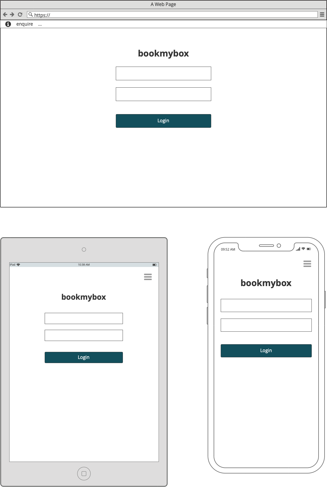
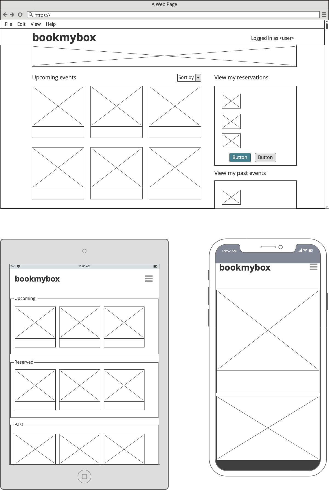
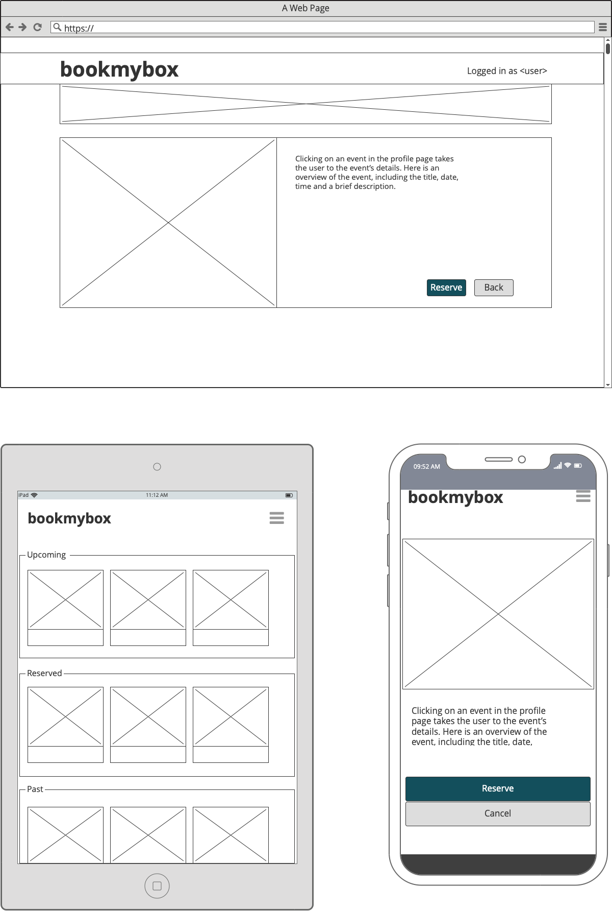
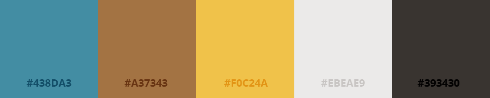
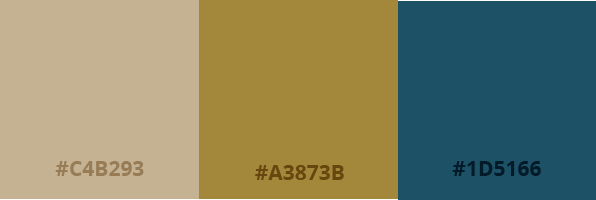
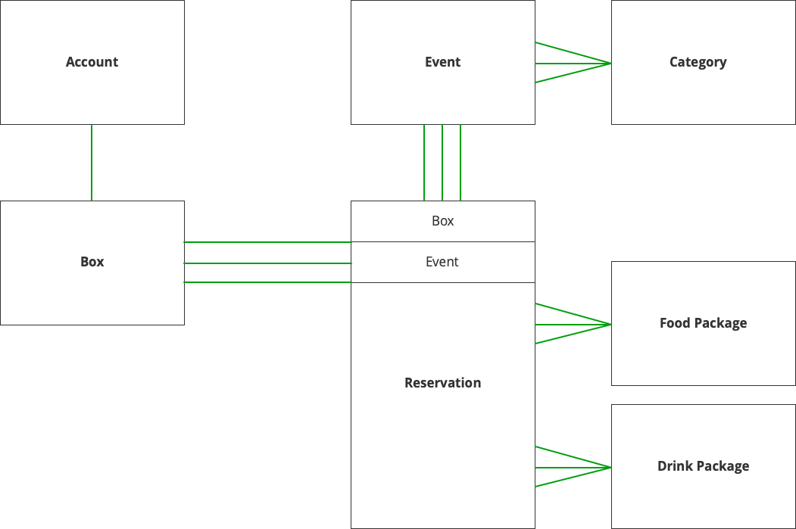

 
 

# Table of contents
1. [Introduction](#introduction)
    * [Objective](#objective)
    * [User stories](#users)
    * [Wireframes](#wireframes)
    * [Design Notes](#design)
2. [UX](#design)
3. [Features](#features)
    * [Existing Features](#existing_feat)
    * [Features left to implment](#future_feat)
4. [Information Architecture](#models)
    * 
5. [Technologies Used](#technologies)
6. [Testing](#testing)
7. [Deployment](#deployment)
8. [Credits](#credits)
    * [Content](#content)
    * [Media](#media)
    * [Acknowledgements](#acknowledgements)

## Introduction 

### Objective 
+ This app provides a platform for private members at an events venue to reserve their hospitality package for upcoming events  

### User Stories 
"As a box owner, I would like to ___________"
+ View the upcoming events 
+ Sort the events by category
+ View individual events in more detail
+ Reserve my box for an upcoming event
+ View different food packages
+ Select a food package
+ Select a drinks package
+ Provide details of the number of guests attending and dietary requirements
+ Review order before placing it
+ Easily Enter Payment information
+ Feel my personal and payment information is secure
+ View my order confirmation after checkout
+ Receive a confirmation email after the checokout is complete
+ Cancel my reservation
+ Modifiy my reservation details
+ View my order history

"As a hospitality manager I would like to _________"
+ Create new members and provide them a one time login
+ Add new events that have just been announced
+ Add and update food packages for the year ahead
+ Add and update drinks packages for the year ahead

### Wireframes 

 
 

 

 
 

 

 
 

### Design Notes 
#### Typography
+ The fonts chosen for this project are <b>"Lobster Two,"</b> <b>"Open Sans"</b> and <b>"EB Garamond."</b> from google fonts
+ Lobster Two is a cursive display font used in this project for the logo and top level headings. It's ligatures that connect individual characters give it the elegance of script but  
+ Any quoted data such as the searched input returned in the 'no results found' message is written in EB Garamond italic. This serif font is traditional and elegant and compliments Patua One.

 
 

## Information Architecture 
### Models

***

&nbsp;

### Profile:

&nbsp;

#### Suite

| Name          | Key in db     | Field Type   | Options                   |
|:--------------|:--------------|:-------------|:--------------------------|
| Suite Number  | suite_no      | IntegerField | primary_key=True          |
| Capacity      | capacity      | IntegerField | max_value=24, blank=True  |

&nbsp;

#### Account

| Name        | Key in db   | Field Type           | Options                    |
|:------------|:------------|:---------------------|:---------------------------|
| Suite       | suite       | OneToOneField(Suite) |                            |
| Name        | name        | CharField            | max_length=75              |
| Email       | email       | EmailField           | max_length=75              |
| Address 1   | address1    | CharField            | max_length=75              |
| Address 2   | address2    | CharField            | max_length=500, blank=True |
| Postcode    | postcode    | CharField            | max_length=75              |
| City        | city        | CharField            | max_length=75              |
| Country     | country     | CharField            | max_length=75              |

&nbsp;

* * *

&nbsp;

### Events:

&nbsp;

#### Category

| Name          | Key in db     | Field Type | Validation                |
|:--------------|:--------------|:-----------|:--------------------------|
| Name          | category_name | CharField  | max_length=75             |
| Friendly Name | friendly_name | CharField  | max_length=75, blank=True |

&nbsp;

#### Event

| Name        | Key in db   | Field Type                                     | Validation                 |
|:------------|:------------|:-----------------------------------------------|:---------------------------|
| Name        | event_name  | CharField                                      | max_length=75              |
| Date        | date        | DateTimeField                                  |                            |
| Category    | event_type  | ForeignKey(Category)                           | on_delete=""               |
| Description | description | TextField                                      | max_length=500, blank=True |
| Image_url   | image_url   | UrlField                                       | blank=True                 |
| Image       | image       | ImageField                                     | blank=True                 |
| Suites      | suites      | ManyToManyField(Suite, through='Reservations') | blank=True                 |

&nbsp;

* * *

&nbsp;

### Reservations:

&nbsp;

#### Food Package

| Name  | Key in db | Field Type   | Validation                                            |
|:------|:----------|:-------------|:------------------------------------------------------|
| Type  | title     | CharField    | max_length=75, blank=False                            |
| Price | price     | DecimalField | max_digits=6, decimal_places=2, null=False, default=0 |

&nbsp;

#### Drinks Package

| Name  | Key in db | Field Type   | Validation                                            |
|:------|:----------|:-------------|:------------------------------------------------------|
| Type  | title     | CharField    | max_length=75, blank=False                            |
| Price | price     | DecimalField | max_digits=6, decimal_places=2, null=False, default=0 |

&nbsp;

#### Reservation:

| Name           | Key in db     | Field Type         | Validation                 |
|:---------------|:--------------|:-------------------|:---------------------------|
| Suite          | suite         | ForeignKey(Suite)  | max_length=75              |
| Event          | event         | ForeignKey(Event)  |                            |
| Guests         | guests_no     | IntegerField       |                            |
| Food Package   | food_package  | ForeignKey(Food)   | max_length=500, blank=True |
| Drinks Package | drink_package | ForeignKey(Drinks) | blank=True                 |

&nbsp;

***

&nbsp;

 
 

