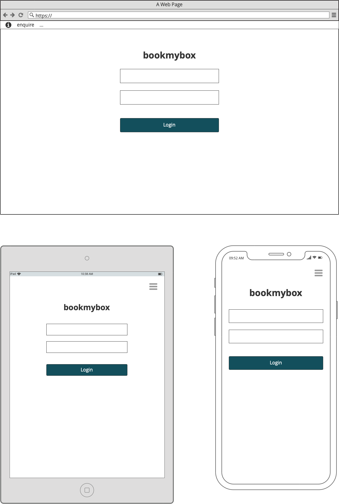
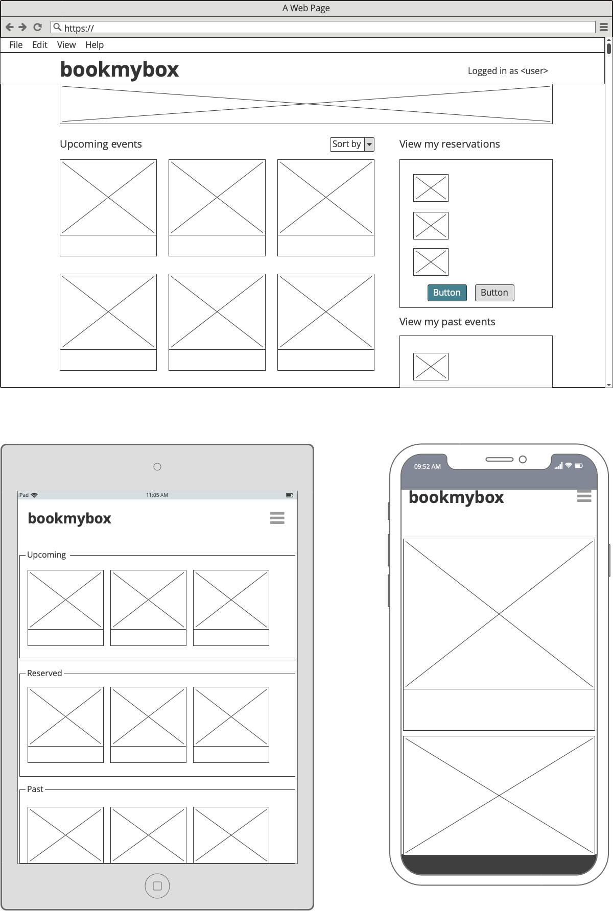
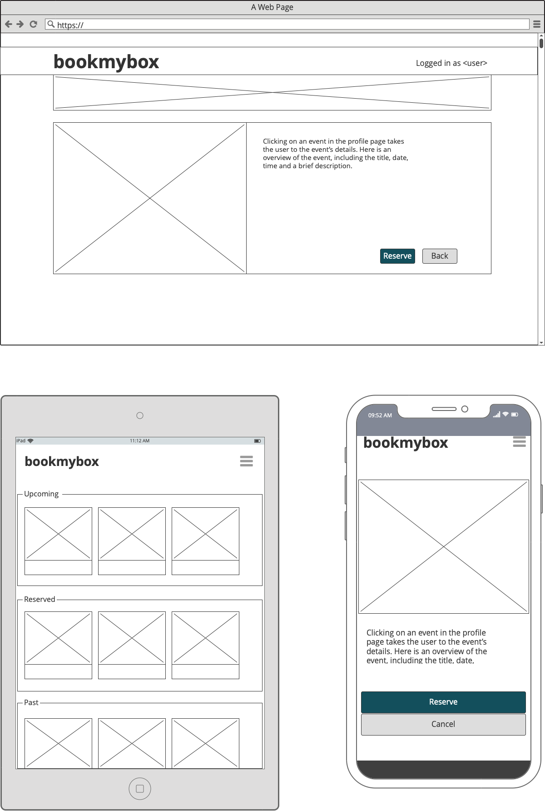
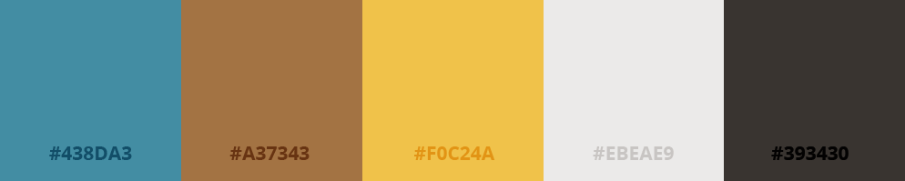
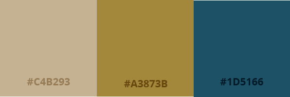
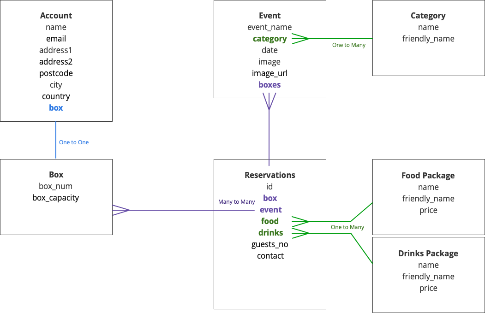

 
 

# Table of contents
1. [Introduction](#introduction)
    * [Objective](#objective)
    * [User stories](#users)
    * [Wireframes](#wireframes)
    * [Design Notes](#design)
2. [UX](#design)
3. [Features](#features)
    * [Existing Features](#existing_feat)
    * [Features left to implment](#future_feat)
4. [Information Architecture](#models)
5. [Technologies Used](#technologies)
6. [Testing](#testing)
7. [Deployment](#deploying)
    * [Run Locally](#local)
    * [Deploy to Heroku](#heroku)
8. [Credits](#credits)
    * [Content](#content)
    * [Media](#media)
    * [Acknowledgements](#acknowledgements)

# Introduction 

## Objective 
+ This app provides a platform for private members at an events venue to reserve their hospitality package for upcoming events  

## User Stories 
"As a box owner, I would like to ___________"
+ View the upcoming events 
+ Sort the events by category
+ View individual events in more detail
+ Reserve my box for an upcoming event
+ View different food packages
+ Select a food package
+ Select a drinks package
+ Provide details of the number of guests attending and dietary requirements
+ Review order before placing it
+ Easily Enter Payment information
+ Feel my personal and payment information is secure
+ View my order confirmation after checkout
+ Receive a confirmation email after the checokout is complete
+ Cancel my reservation
+ Modifiy my reservation details
+ View my order history

"As a hospitality manager I would like to _________"
+ Create new members and provide them a one time login
+ Add new events that have just been announced
+ Add and update food packages for the year ahead
+ Add and update drinks packages for the year ahead

## Wireframes 

 
 

 

 
 

 

 
 

## Design Notes 
### Typography
+ The fonts chosen for this project are <b>"Lobster Two,"</b> <b>"Open Sans"</b> and <b>"EB Garamond."</b> from google fonts
+ Lobster Two is a cursive display font used in this project for the logo and top level headings. It's ligatures that connect individual characters give it the elegance of script but  
+ Any quoted data such as the searched input returned in the 'no results found' message is written in EB Garamond italic. This serif font is traditional and elegant and compliments Patua One.

 
 

# Information Architecture 
## Models

***

&nbsp;

## Profile:

&nbsp;

### Suite

| Name          | Key in db     | Field Type   | Options                   |
|:--------------|:--------------|:-------------|:--------------------------|
| Suite Number  | suite_no      | IntegerField | primary_key=True          |
| Capacity      | capacity      | IntegerField | max_value=24, blank=True  |

&nbsp;

### Account

| Name        | Key in db   | Field Type           | Options                    |
|:------------|:------------|:---------------------|:---------------------------|
| Suite       | suite       | OneToOneField(Suite) |                            |
| Name        | name        | CharField            | max_length=75              |
| Email       | email       | EmailField           | max_length=75              |
| Address 1   | address1    | CharField            | max_length=75              |
| Address 2   | address2    | CharField            | max_length=500, blank=True |
| Postcode    | postcode    | CharField            | max_length=75              |
| City        | city        | CharField            | max_length=75              |
| Country     | country     | CharField            | max_length=75              |

&nbsp;

* * *

&nbsp;

## Events:

&nbsp;

### Category

| Name          | Key in db     | Field Type | Validation                |
|:--------------|:--------------|:-----------|:--------------------------|
| Name          | category_name | CharField  | max_length=75             |
| Friendly Name | friendly_name | CharField  | max_length=75, blank=True |

&nbsp;

### Event

| Name        | Key in db   | Field Type                                     | Validation                 |
|:------------|:------------|:-----------------------------------------------|:---------------------------|
| Name        | event_name  | CharField                                      | max_length=75              |
| Date        | date        | DateTimeField                                  |                            |
| Category    | event_type  | ForeignKey(Category)                           | on_delete=""               |
| Description | description | TextField                                      | max_length=500, blank=True |
| Image_url   | image_url   | UrlField                                       | blank=True                 |
| Image       | image       | ImageField                                     | blank=True                 |
| Suites      | suites      | ManyToManyField(Suite, through='Reservations') | blank=True                 |

&nbsp;

* * *

&nbsp;

## Reservations:

&nbsp;

### Food Package

| Name  | Key in db | Field Type   | Validation                                            |
|:------|:----------|:-------------|:------------------------------------------------------|
| Type  | title     | CharField    | max_length=75, blank=False                            |
| Price | price     | DecimalField | max_digits=6, decimal_places=2, null=False, default=0 |

&nbsp;

### Drinks Package

| Name  | Key in db | Field Type   | Validation                                            |
|:------|:----------|:-------------|:------------------------------------------------------|
| Type  | title     | CharField    | max_length=75, blank=False                            |
| Price | price     | DecimalField | max_digits=6, decimal_places=2, null=False, default=0 |

&nbsp;

### Reservation:

| Name           | Key in db     | Field Type         | Validation                 |
|:---------------|:--------------|:-------------------|:---------------------------|
| Suite          | suite         | ForeignKey(Suite)  | max_length=75              |
| Event          | event         | ForeignKey(Event)  |                            |
| Guests         | guests_no     | IntegerField       |                            |
| Food Package   | food_package  | ForeignKey(Food)   | max_length=500, blank=True |
| Drinks Package | drink_package | ForeignKey(Drinks) | blank=True                 |

&nbsp;

***

&nbsp;

 
 

# Deployment 

 ## Run Locally 

In order to run the project locally, you will need an IDE, PIP, Python version 3.8 and Git installed.
You will need to set up free accounts with AWS for a s3 bucket.

1. Visit the bookmybox repository on Github; [https://github.com/fdeboo/bookmybox](https://github.com/fdeboo/bookmybox) and click on  to clone or download it.

2. Either: 
    * Copy the web url. In the terminal of your IDE, change directory (`cd`) to  where you want the project saved on your system.
    * Type `git clone` and paste in the copied web url to complete the command _(as below)_: 

        <pre><code>git clone https://github.com/fdeboo/bookmybox.git</code></pre>
    
    
    **_or_**

    * Click to **Download Zip** and save the folder somewhere on your local system
    * File > Open the project from within your IDE
    
3. Activate a virtual environment. For this, I recommend using the **pipenv** package which manages the virtualenv and automatically adds/removes packages to a Pipfile when they are un/installed.   
    * On MacOS, pipenv is installed simply by typing `brew install pipenv` in the Mac Terminal. You can read more about pipenv and its installation using other software [here](https://pypi.org/project/pipenv/). 

        _NOTE: The Pipfile created by **pipenv** supersedes the requirements.txt_
    
    * Once pipenv insalled, activate it with the following command:

        <pre><code>pipenv shell</code></pre>

4. Install the project dependencies detailed in the Pipfile by typing  

        pipenv install

5. Set up a .env file in the project root and provide the folllowing environment variables:

        SECRET_KEY=your_secret_key
        DATABASE_URL=your_database_url
        STRIPE_PUBLIC_KEY=your_stripe_public_key
        STRIPE_SECRET_KEY=your_stripe_secret_key
        STRIPE_WH_SECRET=you_stripe_wh_secret
        DEVELOPMENT=True

6. If using VSCode, or if otherwise necessary, restart the IDE and reactivate the virtual environment (as per step 3)
7. Migrate the admin panel models to create the database template:

        python3 manage.py migrate

9. Create a 'superuser' account for access to the django admin panel: 

        python3 manage.py createsuperuser

10. Finally, run the app locally with the following command:
    
        python3 manage.py runserver</code></pre>

 ## Deploying to Heroku 

_NOTE: The Pipfile created by **pipenv** supersedes the requirements.txt and contains all information for the dependencies of the project_

1. Type the following command into the Terminal to create a Procfile:
        
        echo web: python app.py > Procfile

2. Change the contents of the Procfile to 

        web: gunicorn bookmybox.wsgi:application</code></pre>
    
3. Log in to Heroku and click 'New' from your Personal dashboard to Create an New App

